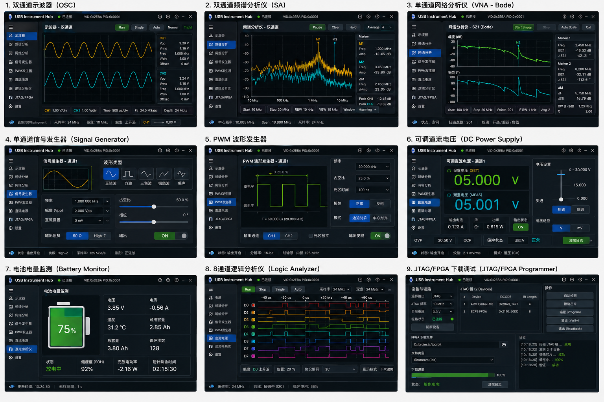

# ZooLark Web Instrument v0.3 — Next.js + WebUSB + RP2350



这是从旧版 WFL 上位机渐进迁移出的 **GitHub / Vercel 可部署网页仪器**。部署依赖锁定 Next.js 16.2.11 Active LTS。

## 当前可演示功能

- 双通道示波器
- 双通道频谱分析
- 单通道网络分析 / Bode
- 单通道信号发生器
- PWM 波形发生器
- 可调直流电源
- 电池监控
- **8 通道逻辑分析仪**：8-bit packed capture、edge trigger、pre-trigger、I2C/SPI/UART/CAN/LIN UI
- **JTAG / FPGA**：TAP Reset、Chain Scan、BIT/BIN/SVF/XSVF/JED 文件、分块上传、进度与校验状态

## 两种运行模式

### Demo / Mock（默认）

部署到 Vercel 后不接硬件也能完整演示 Logic Capture、JTAG Scan 和 FPGA Programming 流程。

### WebUSB 真机

桌面 Chrome / Edge 点击“连接真机”，浏览器直接访问 RP2350 vendor-specific Bulk interface。服务器不转发 USB 数据。

> RP2350 原生 USB 是 USB 2.0-compatible **Full-Speed 12 Mb/s**，因此逻辑分析采用 RP2350 本地高速采样/触发，再通过 USB 分块上传，而不是把 25/50 MHz 采样持续实时流给浏览器。

## 开发

```bash
npm install
npm run check:device
npm run dev
```

访问 `http://localhost:3000`。

## Vercel

把仓库 push 到 GitHub，Vercel Import Project 即可。`vercel.json` 已配置 `Permissions-Policy: usb=(self), serial=(self)`。

## 关键目录

```text
app/                       Next.js App Router
public/app_extended.js     旧版仪器 UI / Canvas 核心
public/device/
  device-stack.js          WFL2 + WebUSB + Mock + Logic + JTAG
  device-bridge.js         将新通信能力接入旧 UI
firmware/rp2350/           RP2350 协议 / PIO scaffold
docs/PROTOCOL_V2.md        WFL2 二进制协议
docs/RP2350_FIRMWARE_ARCHITECTURE.md
```

API 检查：`/api/health`、`/api/protocol`。
